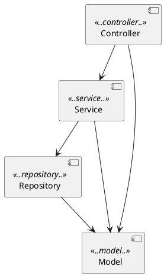

```
 █████╗ ██████╗  ██████╗██╗  ██╗██╗   ██╗███╗   ██╗██╗████████╗
██╔══██╗██╔══██╗██╔════╝██║  ██║██║   ██║████╗  ██║██║╚══██╔══╝
███████║██████╔╝██║     ███████║██║   ██║██╔██╗ ██║██║   ██║
██╔══██║██╔══██╗██║     ██╔══██║██║   ██║██║╚██╗██║██║   ██║
██║  ██║██║  ██║╚██████╗██║  ██║╚██████╔╝██║ ╚████║██║   ██║
╚═╝  ╚═╝╚═╝  ╚═╝ ╚═════╝╚═╝  ╚═╝ ╚═════╝ ╚═╝  ╚═══╝╚═╝   ╚═╝

██████╗ ███████╗███╗   ███╗ ██████╗
██╔══██╗██╔════╝████╗ ████║██╔═══██╗
██║  ██║█████╗  ██╔████╔██║██║   ██║
██║  ██║██╔══╝  ██║╚██╔╝██║██║   ██║
██████╔╝███████╗██║ ╚═╝ ██║╚██████╔╝
╚═════╝ ╚══════╝╚═╝     ╚═╝ ╚═════╝
```

<div align="center">

> *"You take the red pill — you stay in Wonderland, and I show you how deep the rabbit hole goes."*
> — Morpheus, on enforcing architecture rules

[](https://openjdk.org/projects/jdk/21/)
[](https://spring.io/projects/spring-boot)
[](https://www.archunit.org/)
[](https://junit.org/junit5/)
[](https://maven.apache.org/)
[](#)

</div>

---

## ⬛ ENTERING THE MATRIX

```
01001001 00100000 01101011 01101110 01101111 01110111
         01110111 01101000 01111001 00100000 01111001
         01101111 01110101 00100111 01110010 01100101
         00100000 01101000 01100101 01110010 01100101

         >> I know why you're here.
         >> You know that something is wrong with your codebase.
         >> You can feel it — developers bypassing layers,
            naming things `ProductManager`, injecting repos
            into controllers...
         >> The Matrix has you.
         >> ArchUnit can set you free.
```

**ArchUnit** turns architecture decisions into executable tests. Every rule lives
in version control. Every violation fails the build. No manual code reviews
required. No drift. No excuses.

---

## ⬛ SYSTEM SPECS

```
┌─────────────────────────────────────────────────────────┐
│                  S Y S T E M   I N F O                  │
├────────────────────┬────────────────────────────────────┤
│  Runtime           │  Java 21                           │
│  Framework         │  Spring Boot 4.0.5                 │
│  Architecture lib  │  ArchUnit 1.4.1                    │
│  Test runner       │  JUnit 5                           │
│  Persistence       │  Spring Data JPA / H2 (in-memory)  │
│  Build             │  Maven 3.x                         │
│  Architecture      │  Strict 3-tier layered             │
│  Tests             │  24 architecture rules             │
└────────────────────┴────────────────────────────────────┘
```

---

## ⬛ THE CONSTRUCT — APPLICATION STRUCTURE

```
 ╔══════════════════════════════════════════════════════╗
 ║              T H E   M A T R I X   L A Y E R S       ║
 ╠══════════════════════════════════════════════════════╣
 ║                                                      ║
 ║   ┌──────────────────────────────────────────────┐   ║
 ║   │  [ CONTROLLER ]  ProductController.java       │   ║
 ║   │  @RestController  ·  /api/products            │   ║
 ║   │  GET · POST · DELETE                          │   ║
 ║   └───────────────────┬──────────────────────────┘   ║
 ║                       │  may only call ↓              ║
 ║   ┌───────────────────▼──────────────────────────┐   ║
 ║   │  [ SERVICE ]     ProductService.java          │   ║
 ║   │  @Service  ·  Business logic                  │   ║
 ║   │  findAll · findById · save · deleteById       │   ║
 ║   └───────────────────┬──────────────────────────┘   ║
 ║                       │  may only call ↓              ║
 ║   ┌───────────────────▼──────────────────────────┐   ║
 ║   │  [ REPOSITORY ]  ProductRepository.java       │   ║
 ║   │  @Repository  ·  JpaRepository<Product, Long> │   ║
 ║   │  Zero-boilerplate CRUD from Spring Data        │   ║
 ║   └───────────────────┬──────────────────────────┘   ║
 ║                       │  may only call ↓              ║
 ║   ┌───────────────────▼──────────────────────────┐   ║
 ║   │  [ MODEL ]       Product.java                 │   ║
 ║   │  @Entity  ·  id · name · price                │   ║
 ║   │  Accessible by all layers                     │   ║
 ║   └──────────────────────────────────────────────┘   ║
 ║                                                      ║
 ╚══════════════════════════════════════════════════════╝

src/main/java/com/demo/archunit/
├── controller/   ProductController.java
├── service/      ProductService.java
├── repository/   ProductRepository.java
└── model/        Product.java

src/test/java/com/demo/archunit/architecture/
├── LayerArchitectureTest.java
├── NamingConventionTest.java
├── AnnotationRuleTest.java
├── DependencyRuleTest.java
├── CodingRulesTest.java          ← shared rule libraries + custom conditions
├── FreezingArchRuleTest.java     ← incremental adoption for legacy codebases
└── PlantUmlArchitectureTest.java ← diagram IS the test
```

---

## ⬛ SENTINELS — THE 7 GUARDIAN RULES

```
  /\/\/\/\/\/\/\/\/\/\/\/\/\/\/\/\/\/\/\/\/\/\/\/\/\/\/\
  \/  RULE MATRIX — 24 tests · 7 classes · 0 mercy    \/
  /\/\/\/\/\/\/\/\/\/\/\/\/\/\/\/\/\/\/\/\/\/\/\/\/\/\/\
```

### `[01]` LayerArchitectureTest

The first and hardest pill. ArchUnit's `layeredArchitecture()` DSL enforces
strict one-way dependency flow. Upward calls and layer skips are **instantly
fatal**.

```
  CONTROLLER  ──▶  SERVICE  ──▶  REPOSITORY  ──▶  MODEL
      ✗──────────────────────────────▶ skip NOT allowed
      ✗──────────────────────▶ upward NOT allowed
```

---

### `[02]` NamingConventionTest

*"What is real? How do you define 'real'?"* — A `ProductManager` is not real.

```
  RULE ① : *.controller.*  →  name must end with  Controller
  RULE ② : *.service.*     →  name must end with  Service
  RULE ③ : *.repository.*  →  name must end with  Repository
  RULE ④ : *Controller     →  must live in        controller package
  RULE ⑤ : *Service        →  must live in        service package
  RULE ⑥ : *Repository     →  must live in        repository package
  RULE ⑦ : *Manager        →  ██ FORBIDDEN ██
```

---

### `[03]` AnnotationRuleTest

Ensures Spring stereotypes are never forgotten:

```java
  @RestController  ← required on every class in controller package
  @Service         ← required on every class in service package
  JpaRepository    ← every repository interface must extend it
```

---

### `[04]` DependencyRuleTest

No upward deps. No circular deps. No exceptions.

```
  Repositories  ──▶  Services?      ██ ILLEGAL ██
  Services      ──▶  Controllers?   ██ ILLEGAL ██
  Repositories  ──▶  Controllers?   ██ ILLEGAL ██
  A ──▶ B ──▶ C ──▶ A ?             ██ CYCLE DETECTED ██
```

---

### `[05]` CodingRulesTest

Two advanced patterns fused into one:

**① Shared Rule Library** — imports `ArchTests.in(SharedArchRules.class)`,
a portable rule set you can distribute as a JAR across every repo in your org:

```
  ██ System.out / System.err             → use a logger
  ██ throws Exception / RuntimeException → be specific
  ██ java.util.logging                   → use SLF4J
  ██ @Autowired field injection          → constructor injection only
  ██ deprecated API calls                → upgrade your deps
  ██ java.util.Date / Calendar           → use java.time
```

**② Custom ArchCondition** — a bespoke rule that counts constructor parameters
on Spring beans. More than 5? Your class has too many responsibilities.

```java
  // THE RED PILL: your class has 9 constructor parameters.
  // You are not following the Single Responsibility Principle.
  // Wake up, Neo.
```

---

### `[06]` FreezingArchRuleTest

*For those who were already in the Matrix before ArchUnit arrived.*

```
  ┌─────────────────────────────────────────────────────┐
  │  LEGACY CODEBASE DETECTED                           │
  │                                                     │
  │  Existing violations: FROZEN  ← recorded to store  │
  │  New violations:      FATAL   ← break the build     │
  │                                                     │
  │  Fix violations incrementally.                      │
  │  Each one resolved auto-clears from the store.      │
  │  No big-bang rewrite required.                      │
  └─────────────────────────────────────────────────────┘
```

Frozen state lives in `src/test/resources/archunit_store/` — **commit these
files** so every developer shares the same baseline.

---

### `[07]` PlantUmlArchitectureTest

The diagram is not documentation. **The diagram is the test.**



Any Java dependency not represented by an arrow in `architecture.puml` **fails
the build**. Non-developers can propose architecture changes by editing the
diagram — no Java knowledge required.

---

## ⬛ JACKING IN — RUN THE TESTS

```bash
# Enter the Matrix
mvn test

# Expected output:
# -------------------------------------------------------
#  T E S T S
# -------------------------------------------------------
# Tests run: 24, Failures: 0, Errors: 0, Skipped: 0
#
# BUILD SUCCESS
# Total time: 3.141 s
```

---

## ⬛ THE DEMO — TAKE THE RED PILL

### ▶ Phase 1 — Show the green build

```bash
mvn test   # → BUILD SUCCESS
```

### ▶ Phase 2 — Introduce a layer violation

In `ProductController.java`, inject `ProductRepository` directly:

```java
// VIOLATION: Controller bypassing Service to reach Repository
private final ProductRepository productRepository;
```

```bash
mvn test
# ✗ LayerArchitectureTest FAILED
#
#   Architecture violation in (ProductController.java):
#   "Repository was accessed by Controller,
#    but Repository may only be accessed by Service"
```

### ▶ Phase 3 — Introduce a naming violation

Rename `ProductService` → `ProductManager`:

```bash
mvn test
# ✗ NamingConventionTest FAILED
#
#   classes in package '..service..' should have simple name ending with
#   'Service', but the following classes do not:
#   com.demo.archunit.service.ProductManager
#
#   no class should have simple name ending with 'Manager'
```

### ▶ Phase 4 — Introduce an annotation violation

Remove `@Service` from `ProductService`:

```bash
mvn test
# ✗ AnnotationRuleTest FAILED
#
#   classes in 'service' package should be annotated with @Service,
#   but com.demo.archunit.service.ProductService is not.
```

### ▶ Phase 5 — Restore and take the exit

```bash
mvn test   # → BUILD SUCCESS — architecture is protected
```

---

## ⬛ WHY ARCHUNIT?

```
┌──────────────────────────────────────┬──────────────────────────────────────────┐
│  THE OLD WORLD (without ArchUnit)    │  THE MATRIX (with ArchUnit)              │
├──────────────────────────────────────┼──────────────────────────────────────────┤
│  Architecture docs rot instantly     │  Rules live in git — they can't drift    │
│  Violations caught in code review    │  Violations caught at build time         │
│  Diagrams lie                        │  PlantUML diagram IS the test            │
│  Legacy code blocks adoption         │  FreezingArchRule — adopt incrementally  │
│  Standards differ across repos       │  SharedArchRules — one JAR, every repo   │
│  "We just need to be more careful"   │  The machine enforces it. Always.        │
└──────────────────────────────────────┴──────────────────────────────────────────┘
```

---

## ⬛ CHEAT SHEET — KEY ARCHUNIT APIS

| API | Power | Used in |
|-----|-------|---------|
| `layeredArchitecture()` | Declare and enforce layers | `LayerArchitectureTest` |
| `classes().that()…should()` | Fluent rule builder | `NamingConventionTest` |
| `beAnnotatedWith()` | Annotation enforcement | `AnnotationRuleTest` |
| `noClasses().should()` | Negative rules | `DependencyRuleTest` |
| `SlicesRuleDefinition.slices()` | Cycle detection | `DependencyRuleTest` |
| `ArchTests.in(SharedRules.class)` | Portable rule libraries | `CodingRulesTest` |
| `ArchCondition<JavaClass>` | Custom violation logic | `CodingRulesTest` |
| `FreezingArchRule.freeze(rule)` | Legacy adoption | `FreezingArchRuleTest` |
| `adhereToPlantUmlDiagram()` | Diagram-driven tests | `PlantUmlArchitectureTest` |

---

<div align="center">

```
  ┌─────────────────────────────────────────────┐
  │                                             │
  │   This is your last chance.                 │
  │                                             │
  │   You take the BLUE pill — the story ends.  │
  │   Your codebase keeps degrading.            │
  │                                             │
  │   You take the RED pill — you add ArchUnit. │
  │   And I show you how deep the rabbit        │
  │   hole goes.                                │
  │                                             │
  │             [ BLUE ]      [ RED  ]          │
  │                                             │
  └─────────────────────────────────────────────┘
```

*"The Matrix is everywhere. It is all around us."*

</div>
