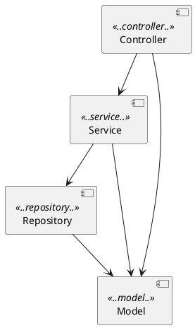

```
 █████╗ ██████╗  ██████╗██╗  ██╗██╗   ██╗███╗   ██╗██╗████████╗
██╔══██╗██╔══██╗██╔════╝██║  ██║██║   ██║████╗  ██║██║╚══██╔══╝
███████║██████╔╝██║     ███████║██║   ██║██╔██╗ ██║██║   ██║
██╔══██║██╔══██╗██║     ██╔══██║██║   ██║██║╚██╗██║██║   ██║
██║  ██║██║  ██║╚██████╗██║  ██║╚██████╔╝██║ ╚████║██║   ██║
╚═╝  ╚═╝╚═╝  ╚═╝ ╚═════╝╚═╝  ╚═╝ ╚═════╝ ╚═╝  ╚═══╝╚═╝   ╚═╝

██████╗ ███████╗███╗   ███╗ ██████╗
██╔══██╗██╔════╝████╗ ████║██╔═══██╗
██║  ██║█████╗  ██╔████╔██║██║   ██║
██║  ██║██╔══╝  ██║╚██╔╝██║██║   ██║
██████╔╝███████╗██║ ╚═╝ ██║╚██████╔╝
╚═════╝ ╚══════╝╚═╝     ╚═╝ ╚═════╝
```

<div align="center">

> *"You take the red pill — you stay in Wonderland, and I show you how deep the rabbit hole goes."*
> — Morpheus, on enforcing architecture rules

[](https://openjdk.org/projects/jdk/21/)
[](https://spring.io/projects/spring-boot)
[](https://www.archunit.org/)
[](https://junit.org/junit5/)
[](https://maven.apache.org/)
[](#)

</div>

---

## ⬛ ENTERING THE MATRIX

```
01001001 00100000 01101011 01101110 01101111 01110111
         01110111 01101000 01111001 00100000 01111001
         01101111 01110101 00100111 01110010 01100101
         00100000 01101000 01100101 01110010 01100101

         >> I know why you're here.
         >> You know that something is wrong with your codebase.
         >> You can feel it — developers bypassing layers,
            naming things `ProductManager`, injecting repos
            into controllers...
         >> The Matrix has you.
         >> ArchUnit can set you free.
```

**ArchUnit** turns architecture decisions into executable tests. Every rule lives
in version control. Every violation fails the build. No manual code reviews
required. No drift. No excuses.

---

## ⬛ SYSTEM SPECS

```
┌─────────────────────────────────────────────────────────┐
│                  S Y S T E M   I N F O                  │
├────────────────────┬────────────────────────────────────┤
│  Runtime           │  Java 21                           │
│  Framework         │  Spring Boot 4.0.5                 │
│  Architecture lib  │  ArchUnit 1.4.1                    │
│  Test runner       │  JUnit 5                           │
│  Persistence       │  Spring Data JPA / H2 (in-memory)  │
│  Build             │  Maven 3.x                         │
│  Architecture      │  Strict 3-tier layered             │
│  Tests             │  28 architecture rules             │
└────────────────────┴────────────────────────────────────┘
```

---

## ⬛ THE CONSTRUCT — APPLICATION STRUCTURE

```
 ╔══════════════════════════════════════════════════════╗
 ║              T H E   M A T R I X   L A Y E R S       ║
 ╠══════════════════════════════════════════════════════╣
 ║                                                      ║
 ║   ┌──────────────────────────────────────────────┐   ║
 ║   │  [ CONTROLLER ]  ProductController.java       │   ║
 ║   │  @RestController  ·  /api/products            │   ║
 ║   │  GET · POST · DELETE                          │   ║
 ║   └───────────────────┬──────────────────────────┘   ║
 ║                       │  may only call ↓              ║
 ║   ┌───────────────────▼──────────────────────────┐   ║
 ║   │  [ SERVICE ]     ProductService.java          │   ║
 ║   │  @Service  ·  Business logic                  │   ║
 ║   │  findAll · findById · save · deleteById       │   ║
 ║   └───────────────────┬──────────────────────────┘   ║
 ║                       │  may only call ↓              ║
 ║   ┌───────────────────▼──────────────────────────┐   ║
 ║   │  [ REPOSITORY ]  ProductRepository.java       │   ║
 ║   │  @Repository  ·  JpaRepository<Product, Long> │   ║
 ║   │  Zero-boilerplate CRUD from Spring Data        │   ║
 ║   └───────────────────┬──────────────────────────┘   ║
 ║                       │  may only call ↓              ║
 ║   ┌───────────────────▼──────────────────────────┐   ║
 ║   │  [ MODEL ]       Product.java                 │   ║
 ║   │  @Entity  ·  id · name · price                │   ║
 ║   │  Accessible by all layers                     │   ║
 ║   └──────────────────────────────────────────────┘   ║
 ║                                                      ║
 ╚══════════════════════════════════════════════════════╝

src/main/java/com/demo/archunit/
├── controller/   ProductController.java
├── service/      ProductService.java
├── repository/   ProductRepository.java
└── model/        Product.java

src/test/java/com/demo/archunit/architecture/
├── LayerArchitectureTest.java
├── NamingConventionTest.java
├── AnnotationRuleTest.java
├── DependencyRuleTest.java
├── CodingRulesTest.java          ← shared rule libraries + custom conditions
├── FreezingArchRuleTest.java     ← incremental adoption for legacy codebases
├── PlantUmlArchitectureTest.java ← diagram IS the test
└── MemberRulesTest.java          ← field and method level rules
```

---

## ⬛ SENTINELS — THE 7 GUARDIAN RULES

```
  /\/\/\/\/\/\/\/\/\/\/\/\/\/\/\/\/\/\/\/\/\/\/\/\/\/\/\
  \/  RULE MATRIX — 28 tests · 8 classes · 0 mercy    \/
  /\/\/\/\/\/\/\/\/\/\/\/\/\/\/\/\/\/\/\/\/\/\/\/\/\/\/\
```

### `[01]` LayerArchitectureTest

The first and hardest pill. ArchUnit's `layeredArchitecture()` DSL enforces
strict one-way dependency flow. Upward calls and layer skips are **instantly
fatal**.

```
  CONTROLLER  ──▶  SERVICE  ──▶  REPOSITORY  ──▶  MODEL
      ✗──────────────────────────────▶ skip NOT allowed
      ✗──────────────────────▶ upward NOT allowed
```

```java
@ArchTest
static final ArchRule layered_architecture_is_respected =
    Architectures.layeredArchitecture()
        .consideringAllDependencies()
        .layer("Controller").definedBy("com.demo.archunit.controller..")
        .layer("Service")   .definedBy("com.demo.archunit.service..")
        .layer("Repository").definedBy("com.demo.archunit.repository..")
        .layer("Model")     .definedBy("com.demo.archunit.model..")

        .whereLayer("Controller").mayNotBeAccessedByAnyLayer()
        .whereLayer("Service")   .mayOnlyBeAccessedByLayers("Controller")
        .whereLayer("Repository").mayOnlyBeAccessedByLayers("Service")
        .whereLayer("Model")     .mayOnlyBeAccessedByLayers("Controller", "Service", "Repository");
```

---

### `[02]` NamingConventionTest

*"What is real? How do you define 'real'?"* — A `ProductManager` is not real.

```
  RULE ① : *.controller.*  →  name must end with  Controller
  RULE ② : *.service.*     →  name must end with  Service
  RULE ③ : *.repository.*  →  name must end with  Repository
  RULE ④ : *Controller     →  must live in        controller package
  RULE ⑤ : *Service        →  must live in        service package
  RULE ⑥ : *Repository     →  must live in        repository package
  RULE ⑦ : *Manager        →  ██ FORBIDDEN ██
```

```java
// Package → Name: if you're IN this package, your name MUST end with...
@ArchTest
static final ArchRule controllers_should_be_named_correctly =
    classes()
        .that().resideInAPackage("..controller..")
        .should().haveSimpleNameEndingWith("Controller")
        .because("Every class in the controller package should be named *Controller");

// Name → Package: if your name ends with ..., you MUST live in the right package
@ArchTest
static final ArchRule classes_named_controller_should_be_in_controller_package =
    classes()
        .that().haveSimpleNameEndingWith("Controller")
        .should().resideInAPackage("..controller..")
        .because("*Controller classes must live in the controller package");

// Negative rule: forbidden name suffix
@ArchTest
static final ArchRule no_classes_should_be_named_Manager =
    noClasses()
        .should().haveSimpleNameEndingWith("Manager")
        .because("We use 'Service' not 'Manager' — please rename to *Service");
```

---

### `[03]` AnnotationRuleTest

Ensures Spring stereotypes are never forgotten:

```java
@ArchTest
static final ArchRule services_should_be_annotated_with_service =
    classes()
        .that().resideInAPackage("..service..")
        .and().areNotInterfaces()
        .should().beAnnotatedWith(Service.class)
        .because("Spring must manage service classes — @Service annotation is required");

@ArchTest
static final ArchRule repositories_should_be_assignable_to_jpa_repository =
    classes()
        .that().resideInAPackage("..repository..")
        .and().areInterfaces()
        .should().beAssignableTo(JpaRepository.class)
        .because("All repositories must extend JpaRepository to get CRUD for free");

@ArchTest
static final ArchRule controllers_should_be_annotated_with_rest_controller =
    classes()
        .that().resideInAPackage("..controller..")
        .should().beAnnotatedWith(RestController.class)
        .because("All our controllers are REST controllers and must be annotated with @RestController");
```

---

### `[04]` DependencyRuleTest

No upward deps. No circular deps. No exceptions.

```
  Repositories  ──▶  Services?      ██ ILLEGAL ██
  Services      ──▶  Controllers?   ██ ILLEGAL ██
  Repositories  ──▶  Controllers?   ██ ILLEGAL ██
  A ──▶ B ──▶ C ──▶ A ?             ██ CYCLE DETECTED ██
```

```java
// Lower layers must not depend on higher layers
@ArchTest
static final ArchRule repositories_should_not_depend_on_services =
    noClasses()
        .that().resideInAPackage("..repository..")
        .should().dependOnClassesThat().resideInAPackage("..service..")
        .because("Repositories are a low-level layer — they must not know about Services");

@ArchTest
static final ArchRule services_should_not_depend_on_controllers =
    noClasses()
        .that().resideInAPackage("..service..")
        .should().dependOnClassesThat().resideInAPackage("..controller..")
        .because("Services must not know about Controllers — that would create an upward dependency");

// Cycle detection — works across any number of packages
@ArchTest
static final ArchRule no_cycles_between_slices =
    SlicesRuleDefinition.slices()
        .matching("com.demo.archunit.(*)..")
        .should().beFreeOfCycles()
        .because("Cyclic dependencies make code hard to understand, test, and refactor");
```

---

### `[05]` CodingRulesTest

Two advanced patterns fused into one:

**① Shared Rule Library** — imports `ArchTests.in(SharedArchRules.class)`,
a portable rule set you can distribute as a JAR across every repo in your org:

```java
// One line imports ALL 6 @ArchTest fields from SharedArchRules:
@ArchTest
static final ArchTests SHARED_CODING_RULES = ArchTests.in(SharedArchRules.class);

// Rules included in SharedArchRules:
//   NO_CLASSES_SHOULD_ACCESS_STANDARD_STREAMS  → no System.out / System.err
//   NO_CLASSES_SHOULD_THROW_GENERIC_EXCEPTIONS → no throws Exception / RuntimeException
//   NO_CLASSES_SHOULD_USE_JAVA_UTIL_LOGGING    → use SLF4J instead
//   NO_CLASSES_SHOULD_USE_FIELD_INJECTION      → constructor injection only
//   DEPRECATED_API_SHOULD_NOT_BE_USED          → no @Deprecated calls
//   OLD_DATE_AND_TIME_CLASSES_SHOULD_NOT_BE_USED → use java.time, not java.util.Date
```

**② Custom ArchCondition** — a bespoke rule that counts constructor parameters
on Spring beans. More than 5? Your class has too many responsibilities.

```java
private static final int MAX_DEPENDENCIES = 5;

@ArchTest
static final ArchRule spring_beans_must_not_exceed_max_dependencies =
    classes()
        .that().areAnnotatedWith(Service.class)
        .or().areAnnotatedWith(Repository.class)
        .or().areAnnotatedWith(RestController.class)
        .should(atMostNConstructorDependencies(MAX_DEPENDENCIES))
        .because("A bean with more than " + MAX_DEPENDENCIES + " dependencies likely violates SRP");

// The custom ArchCondition — extend the DSL with any logic you need:
private static ArchCondition<JavaClass> atMostNConstructorDependencies(int max) {
    return new ArchCondition<>("have at most " + max + " constructor dependencies") {
        @Override
        public void check(JavaClass javaClass, ConditionEvents events) {
            for (JavaConstructor constructor : javaClass.getConstructors()) {
                int paramCount = constructor.getParameterTypes().size();
                if (paramCount > max) {
                    events.add(SimpleConditionEvent.violated(constructor,
                        String.format("Constructor of '%s' has %d dependencies (max allowed: %d) "
                                + "— consider splitting responsibilities into smaller classes",
                            javaClass.getSimpleName(), paramCount, max)));
                }
            }
        }
    };
}
```

---

### `[06]` FreezingArchRuleTest

*For those who were already in the Matrix before ArchUnit arrived.*

```
  ┌─────────────────────────────────────────────────────┐
  │  LEGACY CODEBASE DETECTED                           │
  │                                                     │
  │  Existing violations: FROZEN  ← recorded to store  │
  │  New violations:      FATAL   ← break the build     │
  │                                                     │
  │  Fix violations incrementally.                      │
  │  Each one resolved auto-clears from the store.      │
  │  No big-bang rewrite required.                      │
  └─────────────────────────────────────────────────────┘
```

Frozen state lives in `src/test/resources/archunit_store/` — **commit these
files** so every developer shares the same baseline.

```java
// Wrap ANY existing rule with FreezingArchRule.freeze():
@ArchTest
static final ArchRule frozen_layer_architecture =
    FreezingArchRule.freeze(
        Architectures.layeredArchitecture()
            .consideringAllDependencies()
            .layer("Controller").definedBy("com.demo.archunit.controller..")
            .layer("Service")   .definedBy("com.demo.archunit.service..")
            .layer("Repository").definedBy("com.demo.archunit.repository..")
            .layer("Model")     .definedBy("com.demo.archunit.model..")
            .whereLayer("Controller").mayNotBeAccessedByAnyLayer()
            .whereLayer("Service")   .mayOnlyBeAccessedByLayers("Controller")
            .whereLayer("Repository").mayOnlyBeAccessedByLayers("Service")
            .whereLayer("Model")     .mayOnlyBeAccessedByLayers("Controller", "Service", "Repository")
    );
```

```properties
# src/test/resources/archunit.properties
freeze.store.default.path=src/test/resources/archunit_store
freeze.store.default.allowStoreCreation=true
freeze.store.default.allowStoreUpdate=true
# Tip: set allowStoreUpdate=false in CI to prevent accidentally silencing new violations
```

---

### `[07]` PlantUmlArchitectureTest

The diagram is not documentation. **The diagram is the test.**



Any Java dependency not represented by an arrow in `architecture.puml` **fails
the build**. Non-developers can propose architecture changes by editing the
diagram — no Java knowledge required.

```java
// Load the diagram from the test classpath:
private static final URL ARCHITECTURE_DIAGRAM =
    PlantUmlArchitectureTest.class.getClassLoader().getResource("architecture.puml");

// The diagram IS the rule — any dependency not drawn as an arrow is a violation:
@ArchTest
static final ArchRule classes_should_adhere_to_the_plantuml_diagram =
    classes()
        .that().resideInAnyPackage(
            "..controller..",
            "..service..",
            "..repository..",
            "..model..")
        .should(PlantUmlArchCondition.adhereToPlantUmlDiagram(
            ARCHITECTURE_DIAGRAM,
            consideringOnlyDependenciesInDiagram()))  // ignore Spring/JPA framework deps
        .because("architecture.puml is the single source of truth for allowed layer dependencies");
```

---

### `[08]` MemberRulesTest

Rules are not limited to class-level. ArchUnit can inspect **fields** and
**methods** individually — enforcing encapsulation, immutability, and design
constraints at the member level.

```
  Entity fields            →  must be private     (no public state)
  Service fields           →  must be final       (immutable after construction)
  Controller fields        →  must be final       (immutable after construction)
  Service methods          →  must not be synchronized (no mutable shared state)
```

```java
// Field rule: entity state must be private
@ArchTest
static final ArchRule entity_fields_should_be_private =
    fields()
        .that().areDeclaredInClassesThat().areAnnotatedWith(Entity.class)
        .and().areNotStatic()
        .should().bePrivate()
        .because("JPA entity state must be encapsulated — expose via getters/setters only");

// Field rule: constructor-injected fields should be final
@ArchTest
static final ArchRule service_fields_should_be_final =
    fields()
        .that().areDeclaredInClassesThat().areAnnotatedWith(Service.class)
        .and().areNotStatic()
        .should().beFinal()
        .because("Constructor-injected service fields must be final to guarantee immutability");

// Method rule: synchronized methods indicate mutable state in a singleton
@ArchTest
static final ArchRule service_methods_should_not_be_synchronized =
    noMethods()
        .that().areDeclaredInClassesThat().areAnnotatedWith(Service.class)
        .should().haveModifier(JavaModifier.SYNCHRONIZED)
        .because("Stateless Spring services must not synchronize — use concurrent data structures instead");
```

---

## ⬛ JACKING IN — RUN THE TESTS

```bash
# Enter the Matrix
mvn test

# Expected output:
# -------------------------------------------------------
#  T E S T S
# -------------------------------------------------------
# Tests run: 28, Failures: 0, Errors: 0, Skipped: 0
#
# BUILD SUCCESS
# Total time: 3.141 s
```

---

## ⬛ THE DEMO — TAKE THE RED PILL

### ▶ Phase 1 — Show the green build

```bash
mvn test   # → BUILD SUCCESS
```

### ▶ Phase 2 — Introduce a layer violation

In `ProductController.java`, inject `ProductRepository` directly:

```java
// VIOLATION: Controller bypassing Service to reach Repository
private final ProductRepository productRepository;
```

```bash
mvn test
# ✗ LayerArchitectureTest FAILED
#
#   Architecture violation in (ProductController.java):
#   "Repository was accessed by Controller,
#    but Repository may only be accessed by Service"
```

### ▶ Phase 3 — Introduce a naming violation

Rename `ProductService` → `ProductManager`:

```bash
mvn test
# ✗ NamingConventionTest FAILED
#
#   classes in package '..service..' should have simple name ending with
#   'Service', but the following classes do not:
#   com.demo.archunit.service.ProductManager
#
#   no class should have simple name ending with 'Manager'
```

### ▶ Phase 4 — Introduce an annotation violation

Remove `@Service` from `ProductService`:

```bash
mvn test
# ✗ AnnotationRuleTest FAILED
#
#   classes in 'service' package should be annotated with @Service,
#   but com.demo.archunit.service.ProductService is not.
```

### ▶ Phase 5 — Restore and take the exit

```bash
mvn test   # → BUILD SUCCESS — architecture is protected
```

### ▶ Phase 6 — Introduce a coding rules violation

Add `System.out.println("debug")` anywhere in `ProductService.java`:

```java
public List<Product> findAll() {
    System.out.println("debug: findAll called");  // VIOLATION
    return productRepository.findAll();
}
```

```bash
mvn test
# ✗ CodingRulesTest FAILED (via SharedArchRules)
#
#   no classes should access System.out or System.err,
#   because they are invisible to log filtering and MDC context,
#   but method <ProductService.findAll()> accesses field <System.out>
```

### ▶ Phase 7 — Introduce a field modifier violation

Remove `final` from the `productRepository` field in `ProductService.java`:

```java
private ProductRepository productRepository;  // VIOLATION — not final
```

```bash
mvn test
# ✗ MemberRulesTest FAILED
#
#   fields that are declared in classes that are annotated with @Service
#   and are not static should be final,
#   because Constructor-injected service fields must be final to guarantee immutability,
#   but field <ProductService.productRepository> is not final
```

### ▶ Phase 8 — Restore and take the exit

```bash
mvn test   # → BUILD SUCCESS — 28 rules, 0 violations
```

---

## ⬛ WHY ARCHUNIT?

```
┌──────────────────────────────────────┬──────────────────────────────────────────┐
│  THE OLD WORLD (without ArchUnit)    │  THE MATRIX (with ArchUnit)              │
├──────────────────────────────────────┼──────────────────────────────────────────┤
│  Architecture docs rot instantly     │  Rules live in git — they can't drift    │
│  Violations caught in code review    │  Violations caught at build time         │
│  Diagrams lie                        │  PlantUML diagram IS the test            │
│  Legacy code blocks adoption         │  FreezingArchRule — adopt incrementally  │
│  Standards differ across repos       │  SharedArchRules — one JAR, every repo   │
│  "We just need to be more careful"   │  The machine enforces it. Always.        │
└──────────────────────────────────────┴──────────────────────────────────────────┘
```

---

## ⬛ CHEAT SHEET — KEY ARCHUNIT APIS

| API | Power | Used in |
|-----|-------|---------|
| `layeredArchitecture()` | Declare and enforce layers | `LayerArchitectureTest` |
| `classes().that()…should()` | Fluent rule builder | `NamingConventionTest` |
| `haveSimpleNameEndingWith()` | Name suffix check | `NamingConventionTest` |
| `resideInAPackage()` | Package location check | `NamingConventionTest` |
| `beAnnotatedWith()` | Annotation enforcement | `AnnotationRuleTest` |
| `beAssignableTo()` | Interface/supertype check | `AnnotationRuleTest` |
| `noClasses().should()` | Negative class rules | `DependencyRuleTest` |
| `dependOnClassesThat()` | Dependency direction check | `DependencyRuleTest` |
| `SlicesRuleDefinition.slices()` | Cycle detection | `DependencyRuleTest` |
| `ArchTests.in(SharedRules.class)` | Portable rule libraries | `CodingRulesTest` |
| `ArchCondition<JavaClass>` | Custom violation logic | `CodingRulesTest` |
| `FreezingArchRule.freeze(rule)` | Legacy adoption | `FreezingArchRuleTest` |
| `adhereToPlantUmlDiagram()` | Diagram-driven tests | `PlantUmlArchitectureTest` |
| `fields().that()…should()` | Field-level rules | `MemberRulesTest` |
| `noMethods().that()…should()` | Negative method rules | `MemberRulesTest` |
| `bePrivate()` / `beFinal()` | Access modifier checks | `MemberRulesTest` |
| `haveModifier(JavaModifier.X)` | Any modifier check (SYNCHRONIZED, etc.) | `MemberRulesTest` |
| `areDeclaredInClassesThat()` | Scope rules to a class type | `MemberRulesTest` |

---

<div align="center">

```
  ┌─────────────────────────────────────────────┐
  │                                             │
  │   This is your last chance.                 │
  │                                             │
  │   You take the BLUE pill — the story ends.  │
  │   Your codebase keeps degrading.            │
  │                                             │
  │   You take the RED pill — you add ArchUnit. │
  │   And I show you how deep the rabbit        │
  │   hole goes.                                │
  │                                             │
  │             [ BLUE ]      [ RED  ]          │
  │                                             │
  └─────────────────────────────────────────────┘
```

*"The Matrix is everywhere. It is all around us."*

</div>
